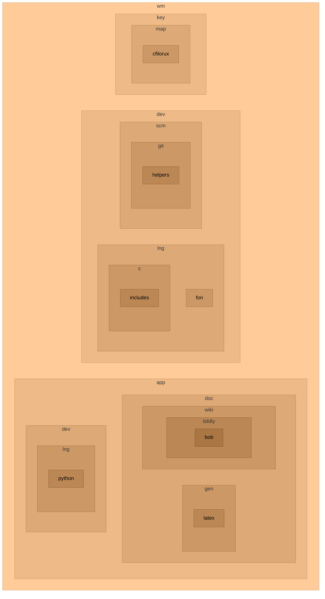

# wenuam

Meaningful development studio with a mindset.

Software architecture, project management, embedded system.

* Home

https://github.com/wenuam

## Repositories



The naming convention is from general to specific :

```wm_key_name(__impl)```

* wm : wenuam's compact form
* key : bi/tri-grams for the section (see `Keys` section below)
* name : repository name or subsection (may be like `key`)
* __impl : specific implementation (optional)

Some repositories may be used in another as submodule, often using only their `name` with no prefix.

Such repositories may not keep a complete history and old binaries be scrubbed, pulling must be forced.

### Keys

Repository keys are as follow (non exhaustive) :

Lower case to prevent disparity/conflict. When in UPPER CASE it signifies a GROUP.

<details>
<summary>Keys (click to expand)</summary>
<p>

| key	| Explanation						|
| :---	| :---								|
| app	| Applications, portable or not		|
| cer	| Certificat						|
| cnv	| Converter							|
| com	| Communication buses				|
| dat	| Data								|
| db	| Database							|
| dev	| Development tools and libraries	|
| doc	| Documentation						|
| ed	| Editor							|
| emu	| Emulation							|
| gen	| Generator							|
| img	| Image (format, viewer, editor)	|
| key	| Keyboard (layout, mapping)		|
| lng	| Languages (programming, natural)	|
| map	| Mapping							|
| net	| Network (protocols, stacks)		|
| os	| Operating system					|
| pcb	| Electronic and related			|
| prj	| Project (files, methodology)		|
| scm	| Source Code Management			|
| snd	| Sound	(format, player, editor)	|
| sys	| System							|
| txt	| Text								|
| ui	| User interface (graphic, text)	|
| utl	| Utility							|
| vid	| Video (format, player, editor)	|
| web	| Internet (format, berowser)		|

</p>
</details>
