# wenuam

Meaningful development studio with a mindset.

Software architecture, project management, embedded system.

* Home

https://github.com/wenuam

Also home of [wm_app], the Cloud Application Repository.

[wm_app]: https://github.com/wenuam/wm_app

## Repositories

The naming convention is from general to specific :

```wm_key_path__Name```

* wm : wenuam's compact form
* key : bi/tri-grams for the section (see `Keys` section below)
* path : repository path or subsection (may be like `key`)
* __Name : actual content (specific implementation, ...)

Some repositories may be used in another ones as submodule, using only their `Name` with no prefix.

### Keys

Repository keys are as follow (non exhaustive) :

Lower case to prevent disparity/conflict. When in UPPER CASE it signifies a GROUP.

| key	| Explanation						|
| :---	| :---								|
| app	| Applications, portable or not		|
| cer	| Certificat						|
| cnv	| Converter							|
| com	| Communication (bus, protocol)		|
| dat	| Data								|
| db	| Database							|
| dev	| Development tools and libraries	|
| doc	| Documentation						|
| ed	| Editor							|
| emu	| Emulation							|
| gen	| Generator							|
| img	| Image (format, viewer, editor)	|
| key	| Keyboard (layout, mapping)		|
| lng	| Languages (programming, natural)	|
| map	| Mapping							|
| net	| Network (protocol, stack)			|
| os	| Operating system					|
| pcb	| Electronic and related			|
| prj	| Project (files, methodology)		|
| scm	| Source Code Management			|
| snd	| Sound	(format, player, editor)	|
| sys	| System							|
| txt	| Text								|
| ui	| User interface (graphic, text)	|
| utl	| Utility							|
| vid	| Video (format, player, editor)	|
| web	| Internet (format, browser)		|

```mermaid
%%{init: {'theme': 'forest'}}%%
flowchart LR
	subgraph wm[wm]
		direction LR
		wm_app[app]
		subgraph wm_app[app]
			direction LR
			subgraph wm_app_db[db]
				direction LR
				subgraph wm_app_db_sql[sql]
					direction LR
					wm_app_db_sql__PostgreSQL[PostgreSQL]
				end
			end
			subgraph wm_app_dev[dev]
				direction LR
				subgraph wm_app_dev_lng[lng]
					direction LR
					subgraph wm_app_dev_lng_bas[bas]
						direction LR
						wm_app_dev_lng_bas__my_basic[my_basic]
					end
					subgraph wm_app_dev_lng_c[c]
						direction LR
						wm_app_dev_lng_c__PellesC[PellesC]
					end
					subgraph wm_app_dev_lng_cpp[cpp]
						direction LR
						wm_app_dev_lng_cpp__WinLibs[WinLibs]
					end
					subgraph wm_app_dev_lng_jar[jar]
						direction LR
						wm_app_dev_lng_jar__jdk[jdk]
					end
					subgraph wm_app_dev_lng_lua[lua]
						direction LR
						wm_app_dev_lng_lua__Lua[Lua]
					end
					subgraph wm_app_dev_lng_pas[pas]
						direction LR
						wm_app_dev_lng_pas__FreePascal[FreePascal]
					end
					subgraph wm_app_dev_lng_pi[pi]
						direction LR
						wm_app_dev_lng_pi__Picat[Picat]
					end
					subgraph wm_app_dev_lng_pl[pl]
						direction LR
						wm_app_dev_lng_pl__StrawberryPerl[StrawberryPerl]
					end
					wm_app_dev_lng_python[python]
					subgraph wm_app_dev_lng_rkt[rkt]
						direction LR
						wm_app_dev_lng_rkt__Racket[Racket]
					end
					subgraph wm_app_dev_lng_v[v]
						direction LR
						wm_app_dev_lng_v__vlang[vlang]
					end
				end
				subgraph wm_app_dev_scm[scm]
					direction LR
					subgraph wm_app_dev_scm_git[git]
						direction LR
						wm_app_dev_scm_git__Git[Git]
					end
				end
			end
			subgraph wm_app_doc[doc]
				direction LR
				subgraph wm_app_doc_cnv[cnv]
					direction LR
					wm_app_doc_cnv__Pandoc[Pandoc]
				end
				subgraph wm_app_doc_gen[gen]
					direction LR
					wm_app_doc_gen_latex[latex]
				end
				subgraph wm_app_doc_tex[latex]
					direction LR
					subgraph wm_app_doc_tex_gen[gen]
						direction LR
						wm_app_doc_tex_gen__Miktex[Miktex]
					end
				end
				subgraph wm_app_doc_pdf[pdf]
					direction LR
					subgraph wm_app_doc_pdf_cnv[cnv]
						direction LR
						wm_app_doc_pdf_cnv__Ghostscript[Ghostscript]
					end
					subgraph wm_app_doc_pdf_utl[utl]
						direction LR
						wm_app_doc_pdf_utl__Tabula[Tabula]
					end
				end
				subgraph wm_app_doc_wiki[wiki]
					direction LR
					subgraph wm_app_doc_wiki_tiddly[tiddly]
						direction LR
						wm_app_doc_wiki_tiddly__Bob[Bob]
					end
				end
			end
			subgraph wm_app_img[img]
				direction LR
				subgraph wm_app_img_2d[2d]
					direction LR
					subgraph wm_app_img_2d_ed[ed]
						direction LR
						wm_app_img_2d_ed__Dia[Dia]
						wm_app_img_2d_ed__Inkscape[Inkscape]
						wm_app_img_2d_ed__yEd[yEd]
					end
					subgraph wm_app_img_2d_gen[gen]
						direction LR
						wm_app_img_2d_gen__ditaa[ditaa]
						wm_app_img_2d_gen__Graphviz[Graphviz]
						wm_app_img_2d_gen__ImageMagick[ImageMagick]
						wm_app_img_2d_gen__mscgen[mscgen]
					end
				end
				subgraph wm_app_img_ocr[ocr]
					direction LR
					wm_app_img_ocr__Tesseract[Tesseract]
				end
			end
			subgraph wm_app_sys[sys]
				direction LR
				subgraph wm_app_sys_emu[emu]
					direction LR
					wm_app_sys_emu__QEMU[QEMU]
				end
				subgraph wm_app_sys_win[win]
					direction LR
					wm_app_sys_win__SysinternalsSuite[SysinternalsSuite]
				end
			end
		end
		subgraph wm_dev[dev]
			direction LR
			subgraph wm_dev_lng[lng]
				direction LR
				subgraph wm_dev_lng_c[c]
					direction LR
					wm_dev_lng_c_includes[includes]
				end
				wm_dev_lng_fori[fori]
			end
			subgraph wm_dev_scm[scm]
				direction LR
				subgraph wm_dev_scm_git[git]
					direction LR
					wm_dev_scm_git__Helpers[Helpers]
				end
			end
		end
		subgraph wm_key[key]
			direction LR
			subgraph wm_key_map[map]
				direction LR
				wm_key_map_cfilorux[cfilorux]
			end
		end
	end

	click wm "https://github.com/wenuam" _blank

	click wm_app "https://github.com/wenuam/wm_app" _blank

	click wm_app_db "https://github.com/wenuam/wm_app_db" _blank
		click wm_app_db_sql "https://github.com/wenuam/wm_app_db_sql" _blank
			click wm_app_db_sql__PostgreSQL "https://github.com/wenuam/wm_app_db_sql__PostgreSQL" _blank

	click wm_app_dev "https://github.com/wenuam/wm_app_dev" _blank
		click wm_app_dev_lng "https://github.com/wenuam/wm_app_dev_lng" _blank
			click wm_app_dev_lng_bas "https://github.com/wenuam/wm_app_dev_lng_bas" _blank
				click wm_app_dev_lng_bas__my_basic "https://github.com/wenuam/wm_app_dev_lng_bas__my_basic" _blank
			click wm_app_dev_lng_c "https://github.com/wenuam/wm_app_dev_lng_c" _blank
				click wm_app_dev_lng_c__PellesC "https://github.com/wenuam/wm_app_dev_lng_c__PellesC" _blank
			click wm_app_dev_lng_cpp "https://github.com/wenuam/wm_app_dev_lng_cpp" _blank
				click wm_app_dev_lng_cpp__WinLibs "https://github.com/wenuam/wm_app_dev_lng_cpp__WinLibs" _blank
			click wm_app_dev_lng_jar "https://github.com/wenuam/wm_app_dev_lng_jar" _blank
				click wm_app_dev_lng_jar__jdk "https://github.com/wenuam/wm_app_dev_lng_jar__jdk" _blank
			click wm_app_dev_lng_lua "https://github.com/wenuam/wm_app_dev_lng_lua" _blank
				click wm_app_dev_lng_lua__Lua "https://github.com/wenuam/wm_app_dev_lng_lua__Lua" _blank
			click wm_app_dev_lng_pas "https://github.com/wenuam/wm_app_dev_lng_pas" _blank
				click wm_app_dev_lng_pas__FreePascal "https://github.com/wenuam/wm_app_dev_lng_pas__FreePascal" _blank
			click wm_app_dev_lng_pi "https://github.com/wenuam/wm_app_dev_lng_pi" _blank
				click wm_app_dev_lng_pi__Picat "https://github.com/wenuam/wm_app_dev_lng_pi__Picat" _blank
			click wm_app_dev_lng_pl "https://github.com/wenuam/wm_app_dev_lng_pl" _blank
				click wm_app_dev_lng_pl__StrawberryPerl "https://github.com/wenuam/wm_app_dev_lng_pl__StrawberryPerl" _blank
			click wm_app_dev_lng_python "https://github.com/wenuam/wm_app_dev_lng_python" _blank
			click wm_app_dev_lng_rkt "https://github.com/wenuam/wm_app_dev_lng_rkt" _blank
				click wm_app_dev_lng_rkt__Racket "https://github.com/wenuam/wm_app_dev_lng_rkt__Racket" _blank
			click wm_app_dev_lng_v "https://github.com/wenuam/wm_app_dev_lng_v" _blank
				click wm_app_dev_lng_v__vlang "https://github.com/wenuam/wm_app_dev_lng_v__vlang" _blank
		click wm_app_dev_scm "https://github.com/wenuam/wm_app_dev_scm" _blank
			click wm_app_dev_scm_git "https://github.com/wenuam/wm_app_dev_scm_git" _blank
				click wm_app_dev_scm_git__Git "https://github.com/wenuam/wm_app_dev_scm_git__Git" _blank

	click wm_app_doc "https://github.com/wenuam/wm_app_doc" _blank
		click wm_app_doc_cnv "https://github.com/wenuam/wm_app_doc_cnv" _blank
			click wm_app_doc_cnv__Pandoc "https://github.com/wenuam/wm_app_doc_cnv__Pandoc" _blank
		click wm_app_doc_gen "https://github.com/wenuam/wm_app_doc_gen" _blank
			click wm_app_doc_gen_latex "https://github.com/wenuam/wm_app_doc_gen_latex" _blank
		click wm_app_doc_tex "https://github.com/wenuam/wm_app_doc_tex" _blank
			click wm_app_doc_tex_gen "https://github.com/wenuam/wm_app_doc_tex_gen" _blank
				click wm_app_doc_tex_gen__Miktex "https://github.com/wenuam/wm_app_doc_tex_gen__Miktex" _blank
		click wm_app_doc_pdf "https://github.com/wenuam/wm_app_doc_pdf" _blank
			click wm_app_doc_pdf_cnv "https://github.com/wenuam/wm_app_doc_pdf_cnv" _blank
				click wm_app_doc_pdf_cnv__Ghostscript "https://github.com/wenuam/wm_app_doc_pdf_cnv__Ghostscript" _blank
			click wm_app_doc_pdf_utl "https://github.com/wenuam/wm_app_doc_pdf_utl" _blank
				click wm_app_doc_pdf_utl__Tabula "https://github.com/wenuam/wm_app_doc_pdf_utl__Tabula" _blank
		click wm_app_doc_wiki "https://github.com/wenuam/wm_app_doc_wiki" _blank
			click wm_app_doc_wiki_tiddly "https://github.com/wenuam/wm_app_doc_wiki_tiddly" _blank
				click wm_app_doc_wiki_tiddly__Bob "https://github.com/wenuam/wm_app_doc_wiki_tiddly__Bob" _blank

	click wm_app_img "https://github.com/wenuam/wm_app_img" _blank
		click wm_app_img_2d "https://github.com/wenuam/wm_app_img_2d" _blank
			click wm_app_img_2d_ed "https://github.com/wenuam/wm_app_img_2d_ed" _blank
				click wm_app_img_2d_ed__Dia "https://github.com/wenuam/wm_app_img_2d_ed__Dia" _blank
				click wm_app_img_2d_ed__Inkscape "https://github.com/wenuam/wm_app_img_2d_ed__Inkscape" _blank
				click wm_app_img_2d_ed__yEd "https://github.com/wenuam/wm_app_img_2d_ed__yEd" _blank
			click wm_app_img_2d_gen "https://github.com/wenuam/wm_app_img_2d_gen" _blank
				click wm_app_img_2d_gen__ditaa "https://github.com/wenuam/wm_app_img_2d_gen__ditaa" _blank
				click wm_app_img_2d_gen__Graphviz "https://github.com/wenuam/wm_app_img_2d_gen__Graphviz" _blank
				click wm_app_img_2d_gen__ImageMagick "https://github.com/wenuam/wm_app_img_2d_gen__ImageMagick" _blank
				click wm_app_img_2d_gen__mscgen "https://github.com/wenuam/wm_app_img_2d_gen__mscgen" _blank
		click wm_app_img_ocr "https://github.com/wenuam/wm_app_img_ocr" _blank
			click wm_app_img_ocr__Tesseract "https://github.com/wenuam/wm_app_img_ocr__Tesseract" _blank

	click wm_app_sys "https://github.com/wenuam/wm_app_sys" _blank
		click wm_app_sys_emu "https://github.com/wenuam/wm_app_sys_emu" _blank
			click wm_app_sys_emu__QEMU "https://github.com/wenuam/wm_app_sys_emu__QEMU" _blank
		click wm_app_sys_win "https://github.com/wenuam/wm_app_sys_win" _blank
			click wm_app_sys_win__SysinternalsSuite "https://github.com/wenuam/wm_app_sys_win__SysinternalsSuite" _blank

	click wm_dev "https://github.com/wenuam/wm_dev" _blank

	click wm_dev_lng "https://github.com/wenuam/wm_dev_lng" _blank
		click wm_dev_lng_c "https://github.com/wenuam/wm_dev_lng_c" _blank
			click wm_dev_lng_c_includes "https://github.com/wenuam/wm_dev_lng_c_includes" _blank
		click wm_dev_lng_fori "https://github.com/wenuam/wm_dev_lng_fori" _blank

	click wm_dev_scm "https://github.com/wenuam/wm_dev_scm" _blank
		click wm_dev_scm_git "https://github.com/wenuam/wm_dev_scm_git" _blank
			click wm_dev_scm_git__Helpers "https://github.com/wenuam/wm_dev_scm_git__Helpers" _blank

	click wm_key "https://github.com/wenuam/wm_key" _blank

	click wm_key_map "https://github.com/wenuam/wm_key_map" _blank
		click wm_key_map_cfilorux "https://github.com/wenuam/wm_key_map_cfilorux" _blank

	classDef lvl0 fill:#fc9,stroke:#da7;
	classDef lvl1 fill:#eb8,stroke:#c96;
	classDef lvl2 fill:#da7,stroke:#b85;
	classDef lvl3 fill:#c96,stroke:#a74;
	classDef lvl4 fill:#b85,stroke:#963;
	classDef lvl5 fill:#a74,stroke:#852;

%%	style wm fill:#f66
	class wm lvl0;

	class wm_app lvl1

	class wm_app_db lvl2
	class wm_app_db_sql lvl3
	class wm_app_db_sql__PostgreSQL lvl4

	class wm_app_dev lvl2
	class wm_app_dev_lng lvl3
	class wm_app_dev_lng_bas lvl4
	class wm_app_dev_lng_bas__my_basic lvl5
	class wm_app_dev_lng_c lvl4
	class wm_app_dev_lng_c__PellesC lvl5
	class wm_app_dev_lng_cpp lvl4
	class wm_app_dev_lng_cpp__WinLibs lvl5
	class wm_app_dev_lng_jar lvl4
	class wm_app_dev_lng_jar__jdk lvl5
	class wm_app_dev_lng_lua lvl4
	class wm_app_dev_lng_lua__Lua lvl5
	class wm_app_dev_lng_pas lvl4
	class wm_app_dev_lng_pas__FreePascal lvl5
	class wm_app_dev_lng_pi lvl4
	class wm_app_dev_lng_pi__Picat lvl5
	class wm_app_dev_lng_pl lvl4
	class wm_app_dev_lng_pl__StrawberryPerl lvl5
	class wm_app_dev_lng_python lvl4
	class wm_app_dev_lng_rkt lvl4
	class wm_app_dev_lng_rkt__Racket lvl5
	class wm_app_dev_lng_v lvl4
	class wm_app_dev_lng_v__vlang lvl5
	class wm_app_dev_scm lvl3
	class wm_app_dev_scm_git lvl4
	class wm_app_dev_scm_git__Git lvl5

	class wm_app_doc lvl2
	class wm_app_doc_cnv lvl3
	class wm_app_doc_cnv__Pandoc lvl4
	class wm_app_doc_gen lvl3
	class wm_app_doc_gen_latex lvl4
	class wm_app_doc_tex lvl3
	class wm_app_doc_tex_gen lvl4
	class wm_app_doc_tex_gen__Miktex lvl5
	class wm_app_doc_pdf lvl3
	class wm_app_doc_pdf_cnv lvl4
	class wm_app_doc_pdf_cnv__Ghostscript lvl5
	class wm_app_doc_pdf_utl lvl4
	class wm_app_doc_pdf_utl__Tabula lvl5
	class wm_app_doc_wiki lvl3
	class wm_app_doc_wiki_tiddly lvl4
	class wm_app_doc_wiki_tiddly__Bob lvl5

	class wm_app_img lvl2
	class wm_app_img_2d lvl3
	class wm_app_img_2d_ed lvl4
	class wm_app_img_2d_ed__Dia lvl5
	class wm_app_img_2d_ed__Inkscape lvl5
	class wm_app_img_2d_ed__yEd lvl5
	class wm_app_img_2d_gen lvl4
	class wm_app_img_2d_gen__ditaa lvl5
	class wm_app_img_2d_gen__Graphviz lvl5
	class wm_app_img_2d_gen__ImageMagick lvl5
	class wm_app_img_2d_gen__mscgen lvl5
	class wm_app_img_ocr lvl3
	class wm_app_img_ocr__Tesseract lvl4

	class wm_app_sys lvl2
	class wm_app_sys_emu lvl3
	class wm_app_sys_emu__QEMU lvl4
	class wm_app_sys_win lvl3
	class wm_app_sys_win__SysinternalsSuite lvl4

	class wm_dev lvl1
	class wm_dev_lng lvl2
	class wm_dev_lng_c lvl3
	class wm_dev_lng_c_includes lvl4
	class wm_dev_lng_fori lvl3

	class wm_dev_scm lvl2
	class wm_dev_scm_git lvl3
	class wm_dev_scm_git__Helpers lvl4

	class wm_key lvl1
	class wm_key_map lvl2
	class wm_key_map_cfilorux lvl3
```

<details>
<summary>Flowchart of available repositories (click to expand)</summary>



</details>
